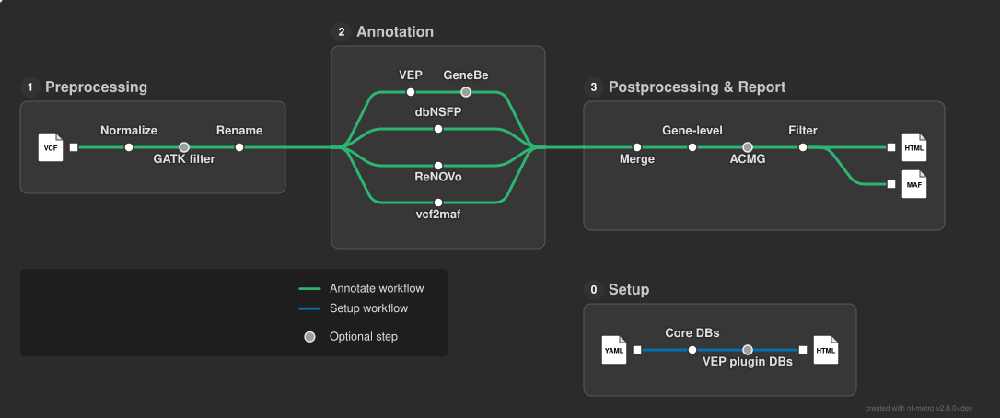

<h1>
  <picture>
    <source media="(prefers-color-scheme: dark)" srcset="docs/images/MuSA_logo_dark.png">
    
  </picture>
</h1>

[](https://www.nextflow.io/)
[](https://github.com/nf-core/tools/releases/tag/3.5.1)
[](https://www.docker.com/)
[](https://sylabs.io/docs/)

## Introduction

**MuSA (Multi-Source variant Annotation)** is an nf-core–compliant Nextflow pipeline for deep, reproducible annotation and clinical ranking of germline genomic variants. It automates the full workflow from database setup through clinical interpretation, and is designed for both routine diagnostic laboratories and research-oriented genomics settings.

MuSA orchestrates four parallel annotation branches — **Ensembl VEP** (with up to 22 curated plugins), a native **dbNSFP** distribution, the **RENOVO** machine-learning pathogenicity predictor, and **vcf2maf** — that are merged into a single richly annotated Mutation Annotation Format (MAF) file (up to ~920 columns per variant). An interactive HTML report is generated for each patient, tailored for clinical review with HPO-matched gene panels.

The pipeline supports two operating modes:
- **Basic mode** — core clinical annotation (VEP, ANNOVAR, dbNSFP, ClinVar, gnomAD) with minimal storage footprint (~123 GB).
- **Extended mode** — ultra-deep annotation additionally enabling 22 VEP plugins (AlphaMissense, CADD, SpliceAI, Enformer, and others) for comprehensive functional characterization (~224 GB total).



---

## Table of Contents

1. [Prerequisites](#prerequisites)
2. [Step 1 — Setup](#step-1--setup)
3. [Step 2 — Test run](#step-2--test-run)
4. [Step 3 — Annotate your data](#step-3--annotate-your-data)
5. [Parameters reference](#parameters-reference)
6. [The database manifest system](#the-database-manifest-system)
7. [Pipeline output](#pipeline-output)
8. [Credits](#credits)
9. [Citations](#citations)

---

## Prerequisites

Before running MuSA you need:

1. **Nextflow ≥ 25.04.0** — `curl -s https://get.nextflow.io | bash`
2. **Docker** or **Singularity/Apptainer** — all tools run inside version-pinned containers; no manual software installation is needed.
3. **ANNOVAR** — MuSA requires ANNOVAR for RENOVO scoring. Users must independently obtain a license and download ANNOVAR from the [official source](https://annovar.openbioinformatics.org/en/latest/). Set `--annovar_software_dir` to the directory containing `table_annovar.pl`.
4. **Disk space** — ~123 GB for basic mode, ~224 GB for extended mode (see [The database manifest system](#the-database-manifest-system) for a full breakdown).

> [!IMPORTANT]
> All annotation data are downloaded by the **setup** workflow into the directory you specify with `--data_dir`. This same directory must be provided to the **annotate** workflow. It is mounted read-only at `/data` inside every container.

> [!NOTE]
> **dbNSFP licensing.** The pipeline downloads the dbNSFP academic distribution. This resource is restricted to non-commercial use. Ensure your use case complies with the [dbNSFP license terms](https://sites.google.com/site/jpopgen/dbNSFP) before running the setup workflow.

---

## Step 1 — Setup

The setup workflow downloads and configures all annotation databases and reference files. It must be run once before the first annotation. Two sub-modes are available depending on whether you plan to use VEP plugins.

### Basic setup (core resources only)

Downloads VEP cache, dbNSFP, ANNOVAR databases, and the reference genome (~123 GB total):

```bash
nextflow run main.nf \
    -profile docker \
    --workflow setup \
    --data_dir /path/to/your/data_dir
```

### Extended setup (core resources + VEP plugins)

Additionally downloads all 22 VEP plugin data files (~224 GB total):

```bash
nextflow run main.nf \
    -profile docker \
    --workflow setup \
    --download_vep_plugins true \
    --data_dir /path/to/your/data_dir
```

Replace `-profile docker` with `-profile singularity` if using Singularity/Apptainer.

The setup workflow produces an HTML summary report listing every downloaded resource, its version, source URL, and SHA-256 checksum (see [The database manifest system](#the-database-manifest-system) for details).

---

## Step 2 — Test run

A minimal test dataset (downsampled NA12878) is bundled with the pipeline. This confirms that your container engine, ANNOVAR installation, and data directory are correctly configured:

```bash
nextflow run main.nf \
    -profile test,docker \
    --data_dir /path/to/your/data_dir \
    --annovar_software_dir /path/to/annovar \
    --outdir output_test
```

The test profile sets `--workflow annotate`, `--vcf_format multicaller`, and `--use_vep_plugins false`. Expected runtime on a modern workstation: a few minutes.

---

## Step 3 — Annotate your data

### 3a. Prepare your samplesheet

Create a CSV file with the following columns:

```csv
patient,sample_type,sample_file,hpo
PATIENT_01,blood,/path/to/PATIENT_01.vcf.gz,HP:0001250;HP:0002121
PATIENT_02,saliva,/path/to/PATIENT_02.vcf.gz,
```

| Column | Required | Description |
|--------|----------|-------------|
| `patient` | ✅ | Unique patient identifier. Used as the prefix for all output files. |
| `sample_type` | ✅ | Tissue of origin (e.g. `blood`, `saliva`). Informational only. |
| `sample_file` | ✅ | Absolute path to the input VCF or VCF.gz file. |
| `hpo` | ⬜ | Semicolon-separated HPO codes (e.g. `HP:0001250;HP:0002121`). Used for HPO-based gene panel retrieval when `--offline false`. Leave empty if not available. |


### 3b. Run the annotate workflow

**Offline mode** (default — no external API calls, uses local databases only):

```bash
nextflow run main.nf \
    -profile docker \
    --workflow annotate \
    --input samplesheet.csv \
    --outdir results \
    --data_dir /path/to/your/data_dir \
    --annovar_software_dir /path/to/annovar \
    --vcf_format multicaller \
    --use_vep_plugins false
```

**Online mode** (enables GeneBe ACMG/AMP scoring and HPO-based gene panel retrieval):

```bash
nextflow run main.nf \
    -profile docker \
    --workflow annotate \
    --input samplesheet.csv \
    --outdir results \
    --data_dir /path/to/your/data_dir \
    --annovar_software_dir /path/to/annovar \
    --vcf_format multicaller \
    --use_vep_plugins false \
    --offline false \
    --gb_user your_genebe_username \
    --gb_api_key your_genebe_api_key
```

A free GeneBe account can be created at [genebe.net](https://genebe.net/signup).

**Extended annotation** (all 22 VEP plugins — requires prior extended setup):

```bash
nextflow run main.nf \
    -profile docker \
    --workflow annotate \
    --input samplesheet.csv \
    --outdir results \
    --data_dir /path/to/your/data_dir \
    --annovar_software_dir /path/to/annovar \
    --vcf_format multicaller \
    --use_vep_plugins true \
    --n_core 16 \
    --offline false \
    --gb_user your_genebe_username \
    --gb_api_key your_genebe_api_key
```

---

## Parameters reference

### Core pipeline parameters

| Parameter | Default | Description |
|-----------|---------|-------------|
| `--workflow` | `annotate` | Workflow to run: `annotate` or `setup`. |
| `--build` | `hg38` | Reference genome build. Only `hg38` is currently supported. |
| `--input` | — | Path to the samplesheet CSV file. **Required** for `annotate`. |
| `--outdir` | — | Output directory. **Required** for `annotate`. |
| `--data_dir` | — | Path to the directory containing annotation databases (created by `setup`). **Required** for both workflows. |
| `--annovar_software_dir` | — | Path to the ANNOVAR software directory (`table_annovar.pl` must be present). **Required** for `annotate`. |
| `--vcf_format` | — | Input VCF format. Supported values: `multicaller` (any standard multi-sample VCF), `sarek` (applies GATK hard filtering). |

### Annotation control

| Parameter | Default | Description |
|-----------|---------|-------------|
| `--offline` | `true` | If `true`, all external API calls (GeneBe, HPO) are skipped. Fully local annotation. |
| `--use_vep_plugins` | `false` | Enable the full suite of 22 VEP plugins. Requires a prior `--download_vep_plugins true` setup. |
| `--n_core` | `8` | Number of CPU cores passed to VEP (`--fork`). |
| `--skip_bcftools` | `false` | Skip bcftools-based VCF normalization and filtering. Use only if your VCFs are already fully normalized. |
| `--dbnsfp_transcript_scores` | `mane` | How dbNSFP's per-transcript score arrays reach the final MAF: `mane` collapses them to the canonical isoform, `all` leaves them as `;`-delimited arrays. See [Transcript-specific dbNSFP scores](#transcript-specific-dbnsfp-scores). |

#### Transcript-specific dbNSFP scores

dbNSFP reports many scores **per transcript**, as `;`-delimited arrays positionally aligned with
`Ensembl_transcriptid`:

```
Ensembl_transcriptid   ENST00000538872;ENST00000382841;ENST00000111111
MANE_dbNSFP            .;Select;.
SIFT_score             0.622;1.0;0.3
REVEL_score            0.361;0.361;0.9
```

Read on its own, `SIFT_score` is ambiguous: nothing in that field says which of the three numbers
belongs to the isoform you care about. The position of the canonical isoform is encoded **only** in
`MANE_dbNSFP` — the offset of `Select` is the offset to read in every other array.
`Ensembl_transcriptid` names the transcript at each position but does not mark which one is
canonical, and `Feature` (VEP's pick) is the most-severe-consequence transcript, which is not
necessarily the MANE one.

`Feature`, `Ensembl_transcriptid` and `MANE_dbNSFP` are all preserved in the final MAF, in either
mode. They answer different questions and none substitutes for another: `Feature` is the single
transcript VEP/vcf2maf selected, and the row's `HGVSc`/`HGVSp`/`Consequence` are expressed against
it; `Ensembl_transcriptid` is the transcript mapping of dbNSFP's own annotations — positional under
`all`, and under `mane` collapsed in lockstep with the scores so it names the one transcript they
came from; `MANE_dbNSFP` marks which position is canonical. Keeping all three lets a downstream
consumer resolve transcript-specific scores explicitly while still seeing dbNSFP's original
annotation.

| Value | Behaviour |
|-------|-----------|
| `mane` (default) | Every transcript-aligned column is rewritten to the single element at the MANE position, so each score column holds one value. When a variant has no MANE transcript the pipeline falls back, in order, to MANE Plus Clinical → the transcript VEP picked (`Feature`) → the first element. One index is chosen per row and applied to every column, so columns can never disagree. `MANE_dbNSFP` is collapsed along with the rest and doubles as a provenance flag: `.` means the scores on that row did **not** come from a MANE transcript. |
| `all` | Arrays are left exactly as dbNSFP produced them. Use this if you would rather resolve transcripts yourself downstream — `Ensembl_transcriptid` and `MANE_dbNSFP` give you everything needed to do so. |

Which columns count as transcript-aligned comes from a fixed, committed list
(`assets/dbnsfp_transcript_aligned_columns.txt`), not from inspecting each run's output. dbNSFP also
uses `;` for gene-level fields (`GO_*`, `Pathway(*)`, `HPO_*`, `MIM_*`, `Orphanet_*`, `GenCC_*`) whose
element count has nothing to do with transcripts, and a per-file guess would collapse a column for
one patient but not the next. As a second safeguard, a value is rewritten only when its element count
matches that row's transcript count. Regenerate the list after a dbNSFP upgrade with
`bin/gen_dbnsfp_aligned_columns.py`.

### Filtering parameters

| Parameter | Default | Description |
|-----------|---------|-------------|
| `--max_freq` | `null` | Maximum population allele frequency (e.g. `0.01`). Variants with `MAX_AF` above this threshold are excluded from the filtered MAF. If `null`, no frequency filter is applied. |
| `--drop_benign` | `false` | If `true`, variants classified as Benign or Likely Benign in ClinVar are excluded from the filtered MAF. |
| `--panel` | `null` | Name (without extension) of a gene panel CSV file located at `{data_dir}/panels/{panel}.csv`. The file must have gene symbols in its first column. When set, only variants in panel genes are retained in the filtered MAF. Can be combined with HPO-based filtering. |

### GeneBe / online mode parameters

These are **required** when `--offline false`.

| Parameter | Default | Description |
|-----------|---------|-------------|
| `--gb_user` | — | GeneBe account username. |
| `--gb_api_key` | — | GeneBe API key. |
| `--http_proxy` | `null` | HTTP proxy address, if required by your network. |
| `--https_proxy` | `null` | HTTPS proxy address, if required by your network. |
| `--skip_genebe` | `false` | Skip GeneBe annotation even when `--offline false`. Useful if the API is unavailable or rate-limited. |

### Setup workflow parameters

| Parameter | Default | Description |
|-----------|---------|-------------|
| `--download_vep_plugins` | `false` | Also download VEP plugin data files during setup (adds ~100 GB). Required before using `--use_vep_plugins true`. |
| `--dbs_manifest` | GitHub URL | URL or path to the database manifest YAML. Override to pin a specific version or use a local copy. See [The database manifest system](#the-database-manifest-system). |

### Miscellaneous

| Parameter | Default | Description |
|-----------|---------|-------------|
| `--center` | `null` | Sequencing centre identifier added to MAF output files. |
| `--email` | `null` | Email address to receive a completion notification. |

---

## The database manifest system

### What it is

All annotation databases downloaded during setup are managed through a central YAML manifest file (`dbs_manifest.yaml`). By default, this file is fetched from the MuSA test-datasets GitHub repository. Each entry in the manifest describes a single downloadable resource:

```yaml
grch38:
  vep_cache:
    dbname: "homo_sapiens_vep_cache"
    version: 115
    out: "homo_sapiens_vep_115_GRCh38.tar.gz"
    url: "https://ftp.ensembl.org/pub/release-115/variation/indexed_vep_cache/homo_sapiens_vep_115_GRCh38.tar.gz"
    method: "curl"
    expected_sha256: "5871a5e34527cce76f7ac75399c33e306bf3be8083c63fe7d3459c56338f98de"
    computed_sha256: ""
```

Fields:
- `dbname` — human-readable name of the resource
- `version` — version of the database
- `url` — canonical download source
- `method` — download tool (`curl` or `wget`)
- `expected_sha256` — cryptographic checksum of the expected file
- `computed_sha256` — filled in at download time by the pipeline

### How it works

When a setup module runs, it:
1. Parses the manifest to extract the URL and method for its resource
2. Downloads the file using the specified tool
3. Computes the SHA-256 checksum of the downloaded file
4. Writes the computed checksum back into the manifest under `computed_sha256`
5. Emits the updated manifest as a Nextflow channel item

All per-module manifests are collected and merged by the `MERGE_YAML` module, producing a single final manifest that records the exact state of every downloaded resource. This merged manifest is then used to generate the HTML setup report.

### Why this matters for reproducibility and auditability

The manifest system provides several guarantees that ad-hoc download scripts cannot:

- **Version pinning.** Every resource is identified by its exact URL and version number, not just a "latest" download. The versions used in any given run are fully captured.
- **Integrity verification.** The expected SHA-256 checksum is stored alongside the URL. Because the pipeline computes and records the actual checksum at download time, any file corruption or unexpected upstream change is immediately detectable by comparing `expected_sha256` and `computed_sha256`.
- **Audit trail.** The final merged manifest (and the HTML setup report derived from it) constitutes a machine-readable record of exactly which database versions, from which sources, were used to produce a given set of annotations. This is directly relevant to clinical and regulatory auditability.
- **Customisation.** Users can supply their own manifest via `--dbs_manifest` to pin alternative database versions, use institutional mirrors, or add new resources — without modifying any pipeline code.

### Resource footprint

| Mode | Resources included | Approximate size |
|------|--------------------|-----------------|
| Basic | VEP cache, ANNOVAR databases, dbNSFP, reference genome | ~123 GB |
| Extended (adds) | AlphaMissense, AncestralAllele, CADD, ClinPred, dbscSNV, Enformer, EVE, GWAS, MaveDB, MaxEntScan, mutfunc, PhenotypeOrthologous, pLI, ReferenceQuality, SpliceVault, UTRAnnotator | +~100 GB |
| **Total (extended)** | | **~224 GB** |

---

## Pipeline output

### Directory structure

For each patient in the samplesheet, MuSA writes results to `{outdir}/{YYMMDD}/{patient}/`:

```
results/
└── 260507/
    └── PATIENT_01/
        ├── PATIENT_01_maf_dashboard.html   # Interactive HTML report
        ├── PATIENT_01.filtered.maf          # Prioritized variants (panel/frequency/benign filters applied)
        └── PATIENT_01.raw.maf               # All annotated variants (no filters)
```

Pipeline-level execution reports are written to `{outdir}/`:

```
results/
├── timeline.txt      # Nextflow execution timeline
├── trace.txt         # Per-process resource usage trace
├── report.html       # Nextflow HTML execution report
└── pipeline_dag.html # Pipeline directed acyclic graph
```

### Annotated MAF files

MuSA uses MAF (Mutation Annotation Format) as its primary output rather than VCF. This deliberate design choice enforces a **one-row-per-variant representation** with canonical MANE transcript selection, reducing the transcript-level redundancy that characterises VCF-based VEP output and making downstream analysis directly tractable.

The raw MAF (`*.raw.maf`) contains all annotated variants and up to ~920 columns organised into thematic groups:

| Category | Source(s) | Example columns |
|----------|-----------|-----------------|
| Variant coordinates & consequence | vcf2maf, VEP | `Hugo_Symbol`, `Chromosome`, `Start_Position`, `Consequence`, `HGVSc`, `HGVSp_VEP`, `genome_change`, `ref_context` |
| Population frequencies | dbNSFP, ANNOVAR | `MAX_AF`, `MAX_AF_POPS`, gnomAD exome/genome AF, TOPMed, All of Us, RegeneronME AF |
| Pathogenicity predictions | dbNSFP | REVEL, MetaSVM, MetaLR, MetaRNN, BayesDel, SIFT, PolyPhen-2, AlphaMissense score/class, VARITY |
| VEP plugin scores | VEP (extended) | AlphaMissense, CADD_PHRED, ClinPred_score, EVE_score, SpliceVault, MaxEntScan, Enformer, mutfunc |
| Splicing | dbNSFP, VEP | dbscSNV Ada/RF, SpliceRegion, MaxEntScan |
| Clinical evidence | ANNOVAR, VEP, GeneBe | `encoded_CLNSIG`, `encoded_CLNREVSTAT`, `clinvar_trait`, `clinvar_id`, `acmg_criteria`, `acmg_score` |
| Disease & gene ontology | dbNSFP | OMIM, Orphanet, GenCC, ClinGen dosage sensitivity, HPO, GWAS |
| RENOVO | RENOVO | `PL_score` (pathogenicity likelihood ∈ [0,1] for missense VUS) |
| MuSA classification | Pipeline | `renovo_adj_acmg_score` (ACMG score adjusted by RENOVO for missense variants) |
| Variant quality | VCF INFO/FORMAT | `bioinfo_params`, `FORMAT_FIELDS`, `FORMAT_VALUES` |

The filtered MAF (`*.filtered.maf`) is a subset of the raw MAF after applying the configured gene panel, allele frequency, and benign-variant filters. When no filters are active, the filtered MAF equals the raw MAF.

### Interactive HTML report

Each patient's `*_maf_dashboard.html` is a self-contained report that requires no server and opens directly in any web browser.

It includes:
- **Summary panel** — patient identifier, total variant count, and counts of ClinVar pathogenic and VUS variants
- **Variant browser** — a sortable, filterable, paginated table with expandable rows. Main columns include gene symbol, cDNA/protein change, ClinVar class, MuSA class (ACMG score adjusted by RENOVO), population allele frequency, and PubMed links. Expandable child rows show additional fields (gDNA change, reference context, variant quality, OMIM/ClinVar IDs, ACMG criteria, orthologous phenotype data)

> [!NOTE]
> Screenshots of the annotation report and the setup report will be added here. Place them in `docs/images/` and reference them below.

<!-- Screenshot placeholder — annotation report -->
<!--  -->

<!-- Screenshot placeholder — setup report -->
<!--  -->

---

## Credits

MuSA was written by D. Scognamiglio and E. Bonetti at IRCCS Istituto Ortopedico Rizzoli, Bologna, Italy.

We thank the [nf-core](https://nf-co.re) community for providing the framework and best practices that guided MuSA's development.

## Citations

An extensive list of references for the tools used by the pipeline can be found in the [`CITATIONS.md`](CITATIONS.md) file.

The MuSA publication can be cited as:

> Pubblication pending