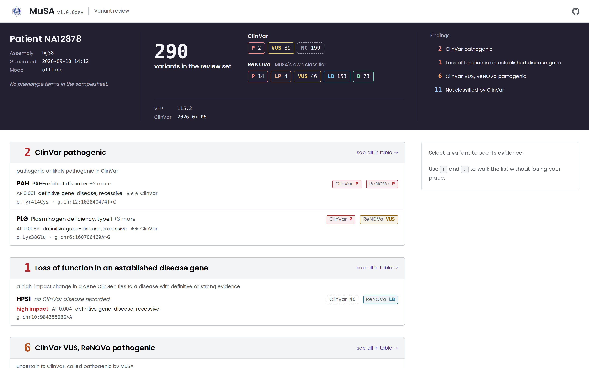
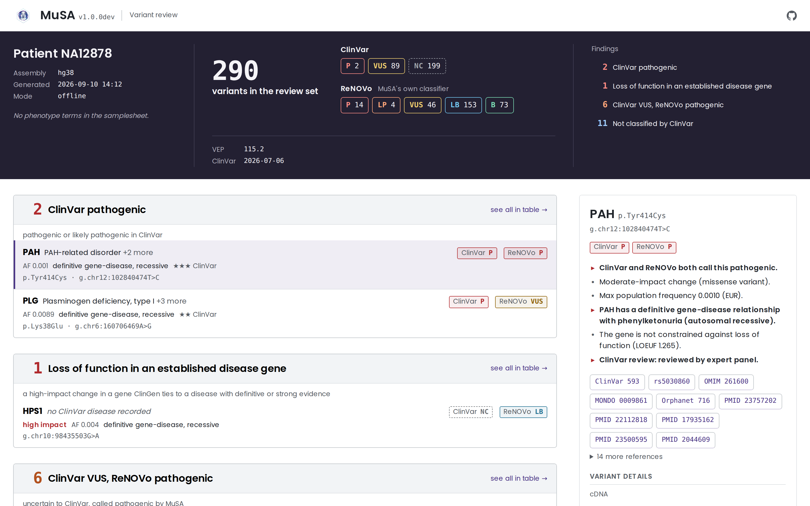

<h1>
  <picture>
    <source media="(prefers-color-scheme: dark)" srcset="docs/images/MuSA_logo_dark.png">
    
  </picture>
</h1>

[](https://www.nextflow.io/)
[](https://www.docker.com/)
[](LICENSE)
[](https://doi.org/10.1186/s12859-026-06513-0)

**MuSA (Multi-Source variant Annotation)** turns a germline VCF into an interpretation-ready MAF and
a self-contained HTML report a clinician can triage without opening a spreadsheet. It runs
**Ensembl VEP and dbNSFP in parallel**, merges them into one row-per-variant table, scores every
variant with the **RENOVO ML pathogenicity classifier**, adds ClinVar/ClinGen/HPO context, and ranks
the result so the variants worth a second look surface first.

Built with the [nf-core](https://nf-co.re) pipeline template, on [Nextflow](https://nextflow.io).
Published in *BMC Bioinformatics* — see [Citation](#citation).


The report below is real output: MuSA run in extended mode against the paper's own NA12878/HG001
WES-like benchmark VCF (see [Benchmark](#benchmark)). Nothing in it is mocked up.



---

## Can you use MuSA?

| | |
|---|---|
| **Genome build** | GRCh38/hg38 only. |
| **Input** | Germline VCFs already called elsewhere (nf-core/sarek, GATK, or any standard multi-caller VCF). MuSA annotates and ranks; it does not call variants. |
| **Compute** | Docker, Singularity or Apptainer. No manual tool installation. |
| **Storage, one-time** | ~72 GB for core annotation, ~173 GB if you also want the 22 VEP plugins. Downloaded once by the `setup` workflow, reused by every `annotate` run. |
| **dbNSFP** | The bundled distribution is **non-commercial / academic use only**. Check the [dbNSFP license](https://sites.google.com/site/jpopgen/dbNSFP) covers your use case before running `setup`. |
| **GeneBe (optional)** | Only needed for online-mode ACMG/AMP scoring and live HPO gene-panel lookup. Free account at [genebe.net](https://genebe.net/signup). Offline mode (the default) needs neither. |
| **License** | MuSA itself is [CC BY-NC 4.0](LICENSE) — non-commercial use and redistribution, with attribution. |

If your VCFs are hg38, you can get Docker or Singularity running, and 72 GB of disk is available:
MuSA is feasible for you. If any of those don't hold, see [Requirements](#requirements-and-constraints)
before going further.

---

## Why MuSA?

A germline VCF from a research or diagnostic exome/genome typically needs several tools before a
clinician can read it: a functional-consequence predictor, a set of pathogenicity scores, ClinVar,
a gene-disease evidence source, and some way to fold "unaffected by ClinVar but the phenotype fits"
into a ranking. Running these tools separately means reconciling different variant identifiers,
different transcript choices, and different output formats — and re-doing that reconciliation for
every patient.

MuSA runs the annotation branches in parallel and resolves the disagreements once, in the pipeline,
rather than leaving them for a reviewer to spot:

- **One transcript per variant.** VEP/dbNSFP report scores per transcript; MuSA collapses each
  variant to its MANE Select transcript (configurable) so a gene symbol and a score never come from
  two different isoforms.
- **One classification per variant.** RENOVO's six-class ML output and ClinVar's five-tier
  classification are read onto the same B / LB / VUS / LP / P scale, so "ClinVar disagrees with
  ReNOVo" is something the pipeline can flag, not something a reviewer has to notice by reading two
  differently-formatted columns.
- **Rarity and disease relevance are the filter, not a spreadsheet macro.** Gene-disease validity
  (ClinGen), inheritance mode, gnomAD constraint (pLI/LOEUF) and the patient's own HPO terms are
  joined onto every row so triage doesn't need a second lookup pass.

The output is one MAF file per patient (not per-transcript VCF rows) and one interactive report that
opens in a browser with no server, no account and no upload — the variant data never leaves the
machine it was generated on.

---

## What MuSA does

Two workflows:

| Workflow | What it does | Run it |
|---|---|---|
| `setup` | Downloads and checksums every annotation database into `--data_dir`. Once per data directory. | before the first `annotate` |
| `annotate` | Annotates VCFs against that data directory, ranks variants, writes MAF + HTML report. | once per batch of patients |

**Annotation sources**, merged into one table:

| Source | Contributes |
|---|---|
| [Ensembl VEP](https://www.ensembl.org/info/docs/tools/vep/index.html) | Consequence, transcript annotation, population frequencies (gnomAD/1000G), and — in extended mode — up to 22 plugins (AlphaMissense, CADD, ClinPred, Enformer, EVE, SpliceVault, MaxEntScan and others) |
| [dbNSFP](https://sites.google.com/site/jpopgen/dbNSFP) | Pathogenicity predictions (REVEL, MetaRNN, BayesDel, SIFT, PolyPhen-2…), gene-level constraint, disease/phenotype cross-references |
| [RENOVO 1.5](https://github.com/davide-scognamiglio/renovo-rebuild) | ML pathogenicity score and class for every variant: RENOVO's published model, run on the VEP, dbNSFP and ClinVar columns above ([renovo-rebuild](https://github.com/davide-scognamiglio/renovo-rebuild)) |
| ClinVar / ClinGen | Clinical significance, review status, gene-disease validity and inheritance mode |
| [HPO](https://hpo.jax.org/) | Phenotype-matched gene panels, from the samplesheet's `hpo` column |
| [GeneBe](https://genebe.net/) *(optional, online mode)* | Automated ACMG/AMP criteria and score |

**Output**, per patient:

- `<patient>.raw.maf` — every variant, fully annotated, one row per variant.
- `<patient>.filtered.maf` — the same table after panel/HPO/frequency/benign filters. The file to hand a reviewer.
- `<patient>_maf_dashboard.html` — the interactive report (below).

Full column-by-column breakdown: [`docs/output.md`](docs/output.md).

---

## The report

`<patient>_maf_dashboard.html` is a single file — no server, no database, no upload. It embeds the
full variant set as compact, column-oriented JSON and renders it through a virtual scroller, so it
stays fast even at tens of thousands of variants, and it opens directly in a browser on an
air-gapped machine.

It opens on **findings, not a spreadsheet**: variants grouped by why they matter — ClinVar
pathogenic/likely-pathogenic, loss-of-function in a disease gene ClinGen backs with definitive or
strong evidence, biallelic calls with no wild-type allele, ClinVar-uncertain-but-RENOVo-pathogenic,
genes ClinVar has never classified, and cases where the two classifiers disagree. Selecting a
variant opens a full evidence panel beside the list — population frequency, gene-disease
relationship, inheritance, literature, all cross-referenced and clickable (OMIM, PubMed, MONDO,
Orphanet, dbSNP, ClinVar) — without ever covering the list you're comparing it against. The full
variant table, sortable and searchable, is one click away for anyone who wants to see everything
that was annotated rather than only what was flagged.



---

## Try it in 10 minutes

The database directory (below) is a one-time, ~72 GB download — it is the actual gate, not a
formality, so budget time for it separately. Once it exists, running MuSA against a new VCF, or
against the bundled single-variant test case, takes minutes.

**1. Install Nextflow** (skip if already installed; MuSA needs version 25.10.0 or later):

```bash
curl -s https://get.nextflow.io | bash
```

Already have Nextflow? Check `nextflow -version`, and run `nextflow self-update` if it is older than 25.10.0.

**2. Build the database directory** — required once, before any `annotate` run:

```bash
nextflow run davide-scognamiglio/MuSA \
  --workflow setup \
  --data_dir /path/to/musa_data \
  -profile docker
```

This fetches VEP's cache, dbNSFP, ClinVar/ClinGen and the reference genome
(~72 GB). Get a coffee; it does not need supervision, and `<data_dir>/setup_report.html` lists
exactly what landed and its checksum when it's done.

**3. Run the bundled test** — a single-variant VCF, so this finishes in a couple of minutes and
proves your Docker and data directory are wired correctly:

```bash
nextflow run davide-scognamiglio/MuSA \
  -profile test,docker \
  --data_dir /path/to/musa_data \
  --outdir output_test
```

Expect `output_test/<date>/NA12877/NA12877_maf_dashboard.html` — open it in a browser.

That's the smallest loop: real containers, a real (if tiny) VCF, a real report. Section
[Pipeline usage](#pipeline-usage) below shows the same command against your own samplesheet.

---

## Requirements and constraints

**Genome build.** hg38/GRCh38 only. The pipeline errors explicitly (`Currently, we only support hg38
build`) rather than silently mis-annotating a GRCh37 VCF — realign or lift over first.

**Storage — two tiers, pick based on what you need:**

| Mode | What it adds | Approx. size | When to use it |
|---|---|---|---|
| **Basic** (`setup` default) | VEP cache, dbNSFP, ClinVar/ClinGen, reference genome | ~72 GB | Routine diagnostic annotation |
| **Extended** (`--download_vep_plugins true`) | + all 22 VEP plugin data files (AlphaMissense, CADD, Enformer, EVE, GWAS, MaveDB, ...) | ~173 GB total | Deep functional characterization; required before `--use_vep_plugins true` |

**RENOVO scores come from RENOVO 1.5.** MuSA scores variants with
[renovo-rebuild](https://github.com/davide-scognamiglio/renovo-rebuild), which runs RENOVO's
published model on MuSA's own annotations instead of an ANNOVAR re-annotation. Discrimination is
unchanged within 0.001 AUC on ClinVar variants RENOVO never saw, but individual scores differ from
the original software, so do not compare `RENOVO_Class` across MuSA 1.1 and 1.2 results. RENOVO is
non-commercial software; commercial use needs the RENOVO authors' permission.

**dbNSFP is academic-use only.** The setup workflow downloads dbNSFP's academic-branch distribution.
Confirm your use case is covered by the [dbNSFP license](https://sites.google.com/site/jpopgen/dbNSFP)
before running `setup` — this is a constraint on the data, not something MuSA can relax.

**GeneBe is optional and needs credentials.** Only relevant if you run with `--offline false` for
automated ACMG/AMP scoring or live HPO-based gene-panel lookup. Offline mode — the default — uses
none of it and makes no outbound network calls.

**MuSA's own license is CC BY-NC 4.0** — non-commercial use and redistribution with attribution. See
[LICENSE](LICENSE).

---

## Installation / setup

Prerequisites: [Nextflow ≥ 25.10.0](https://nextflow.io) and Docker or Singularity/Apptainer.

> [!NOTE]
> On an older Nextflow, MuSA stops before running anything with
> `Plugin nf-schema with version @2.7.3 does not exist in the repository`. Nextflow 25.04 and
> earlier read an older plugin index that doesn't list the nf-schema versions MuSA needs. Run
> `nextflow self-update`, or pin a version for one run with `NXF_VER=25.10.2 nextflow run ...`.

```bash
nextflow run davide-scognamiglio/MuSA \
  --workflow setup \
  --data_dir /path/to/musa_data \
  -profile docker            # or -profile singularity
```

Add `--download_vep_plugins true` for the extended (~173 GB) tier. Re-running `setup` later only
re-downloads entries whose manifest version changed (`--update_db_only true` to force a diff-only
refresh).

Every downloaded resource is tracked in a versioned, checksummed manifest — see
[The database manifest system](docs/usage.md#setup-workflow) for how that works and why it matters
for audit trails. Full parameter reference: [`docs/usage.md`](docs/usage.md) and
[`nextflow_schema.json`](nextflow_schema.json) (or run with `--help`).

---

## Pipeline usage

**1. Samplesheet** — one row per patient:

```csv title="samplesheet.csv"
patient,sample_type,sample_file,hpo
PATIENT_01,blood,/path/to/PATIENT_01.vcf.gz,HP:0001250;HP:0002121
PATIENT_02,saliva,/path/to/PATIENT_02.vcf.gz,
```

| Column | Required | Description |
|---|---|---|
| `patient` | yes | Identifier. Names the output directory and every output file. |
| `sample_type` | yes | Free-text sample source (`blood`, `saliva`, ...). Informational. |
| `sample_file` | yes | Path to the VCF, `.vcf` or `.vcf.gz`. |
| `hpo` | no | `;`-separated HPO term IDs. Drives phenotype-based gene-panel filtering; leave empty to skip. |

**2. Run** — offline mode (default; no network calls, local databases only):

```bash
nextflow run davide-scognamiglio/MuSA \
  --workflow annotate \
  --input samplesheet.csv \
  --outdir results \
  --data_dir /path/to/musa_data \
  --vcf_format multicaller \
  -profile docker
```

Add `--use_vep_plugins true` for extended annotation (needs the extended `setup`), or
`--offline false --gb_user <user> --gb_api_key <key>` for GeneBe ACMG/AMP scoring and live HPO
lookups. Full walkthrough, including proxy configuration and params files:
[`docs/usage.md`](docs/usage.md).

**3. Output** — `results/<date>/<patient>/`, one directory per patient:

```
results/
└── 260907/
    └── PATIENT_01/
        ├── PATIENT_01_maf_dashboard.html
        ├── PATIENT_01.filtered.maf
        └── PATIENT_01.raw.maf
```

Column-by-column breakdown of what's in the MAF: [`docs/output.md`](docs/output.md).

---

## Benchmark

Same dataset, same in-house server (Intel Xeon Gold 6444Y, 64 cores, 250 GB RAM), two pipeline
versions: a downsampled, WES-like NA12878/HG001 (GRCh38) callset, ~22,700 variants, full
extended-mode annotation (all 22 VEP plugins).

| Version | Wall time | CPU time |
|---|---|---|
| v1.0.0 (paper-published figure) | ~20 minutes | — |
| v1.1.0 | **3m 23s** | 0.8 CPU-hours |

The difference is dbNSFP, not the hardware: in v1.0.0 it ran as a single pass over the whole VCF,
which dominated wall time; v1.1.0 shards the VCF by chromosome and annotates the shards in
parallel. Everything else about the run is the same dataset, mode and machine.

This is a fixed reference point on fixed hardware, not a guarantee — your runtime scales with core
count, VCF size, and whether you run basic or extended mode. Per-task resource use for any of your
own runs is in `<outdir>/pipeline_info/execution_trace_*.txt`.

---

## Citation

If you use MuSA, please cite:

> Scognamiglio D, Bonetti E, Moroni A, Sangiorgi L, Pedrini E. MuSA: a Nextflow pipeline for deep,
> reproducible annotation and clinical ranking of genomic variants. *BMC Bioinformatics*. 2026 Jun
> 16;27(1):199. doi: [10.1186/s12859-026-06513-0](https://doi.org/10.1186/s12859-026-06513-0).

An extensive list of references for every tool the pipeline uses is in
[`CITATIONS.md`](CITATIONS.md).

---

## License, acknowledgements, contact

MuSA is licensed under [CC BY-NC 4.0](LICENSE) — non-commercial use and redistribution, with
attribution.

Written by D. Scognamiglio and E. Bonetti at IRCCS Istituto Ortopedico Rizzoli, Bologna, Italy, with
contributions from A. Moroni, L. Sangiorgi and E. Pedrini. Built with the
[nf-core](https://nf-co.re) pipeline template; thanks to that community for the tooling and
conventions MuSA's development leaned on.

Questions or issues: [open a GitHub issue](https://github.com/davide-scognamiglio/MuSA/issues).
